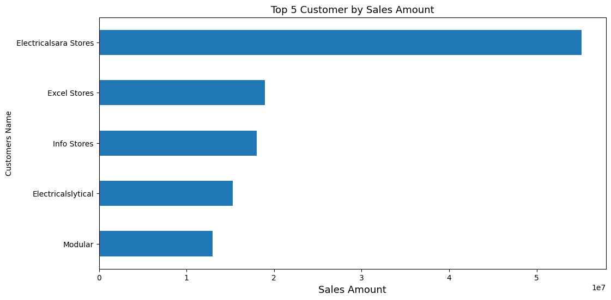
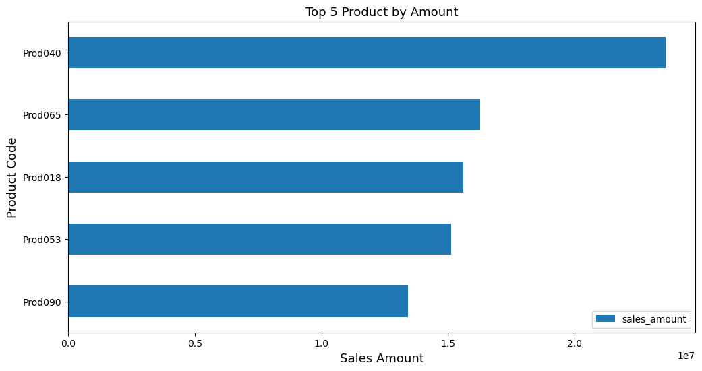

# Sales Insights 📊🏥

Welcome to my latest data analyst project, where I'm excited to share my journey into the world of data analysis. Using Python, Pandas, Seaborn, and Matplotlib, I dived deep into a vast trove of data to unlock hidden insights and drive strategic decisions.

## Project Overview 📂

I started by importing five key tables from an SQL database - 'markets,' 'customers,' 'products,' 'transactions,' and 'dates.' The journey began with data cleaning and meticulous handling of missing values, ensuring data accuracy.

## Data Exploration 🔍

I then explored each of these tables, unraveling valuable patterns and trends. It was fascinating to see the data come to life as I combined them with the 'transactions' table to create a new 'sales' table.

## Project Highlights 📈

- **Data Preprocessing:** Handling missing values, outliers, and irrelevant columns was a critical part of this project. Data cleaning techniques were employed to ensure the integrity of the data.

- **Data Visualization:** Visualizations were key in this project, and I used Matplotlib and Seaborn to present my findings. These visualizations were instrumental in identifying crucial insights and trends within the data.

## Acknowledgments 🙌

I'd like to extend a heartfelt thanks to Motaseam Yousef for his invaluable support and guidance throughout this project. Also, a big shoutout to SHAI For AI | شاي للذكاء الاصطناعي For AI for their expertise and resources, which were integral to achieving meaningful results.

## Project Visuals 📸

*Top 5 Customer By Sales Amount*

*Top 5 Product By Amount*

*Total Revenue By Customer Name*

## Project Links 🔗

Curious to explore the full project and its findings? Dive into the details at:

- [GitHub](https://lnkd.in/ew_CyVuU)
- [Google Colab](https://lnkd.in/eJHVqBhG)

Your thoughts and feedback are always welcome; I'm eager to hear your insights!

#DataAnalysis #Python #DataInsights #DataVisualization #LinkedInProject
